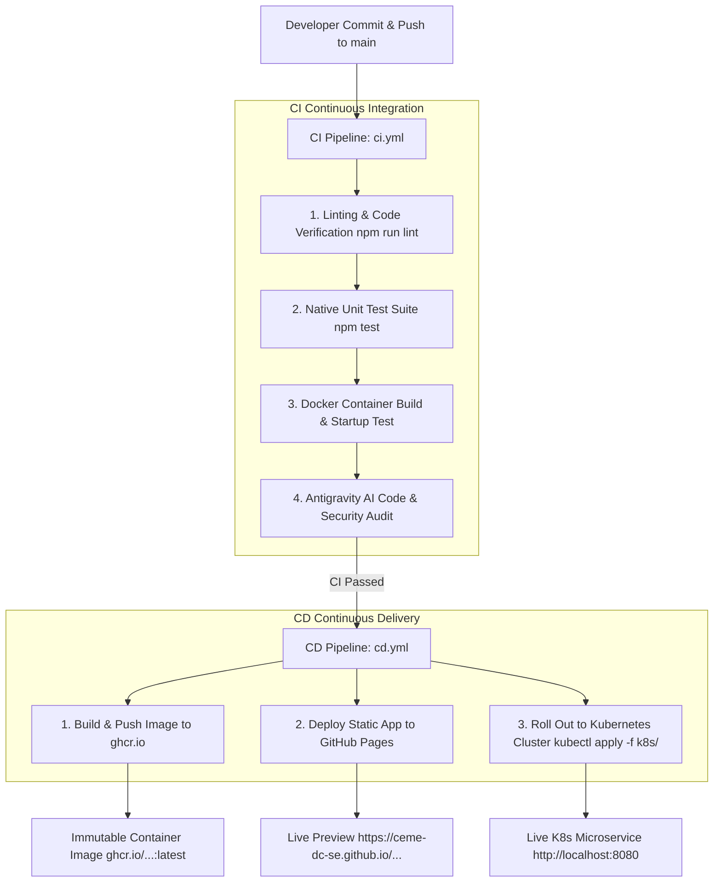

# ☸️ K8s Web Calculator & Cluster Dashboard Microservice (CI/CD Demo)

An enterprise-grade demonstration of a **containerized Node.js microservice**, **Kubernetes pod load-balancing**, and an automated **CI/CD Pipeline** with Google Antigravity AI Code Auditing, GitHub Container Registry (`ghcr.io`), GitHub Pages, and automated Kubernetes deployments.

---

## 📌 Project Overview & Architecture

This repository demonstrates how a modern web application transitions from local code development to automated cloud CI/CD and Kubernetes container orchestration:

1. **Dual-Module Core Math Engine**: Written in vanilla JavaScript (`src/math.js`), supporting both Node.js CommonJS (`module.exports`) and Browser ES/Global environments (`window.MathLib`).
2. **Interactive Web Calculator & Cluster Dashboard**: Modern dark-mode UI (`public/index.html`, `public/app.js`, `public/style.css`) featuring a live Kubernetes Pod topology visualizer and real-time backend telemetry.
3. **Multi-Stage Docker Containerization**: Optimized 2-stage lightweight Alpine container (`Dockerfile`) running as a secure, non-root user (`appuser`).
4. **Kubernetes Orchestration**: Deployment manifests (`k8s/`) configured with 3 pod replicas, rolling update strategy, Downward API pod/node metadata mapping (`POD_NAME`, `POD_IP`, `NODE_NAME`), and health probes (`/api/cluster/info`).
5. **Automated CI/CD Workflows**: Built-in GitHub Actions workflows forContinuous Integration (`.github/workflows/ci.yml`) and Continuous Delivery (`.github/workflows/cd.yml`).

---

## 🔄 How the CI/CD Pipeline Operates



### 1. Continuous Integration Workflow ([.github/workflows/ci.yml](file:///.github/workflows/ci.yml))
Triggered on `push` or `pull_request` to `main`:
- **Linting & Code Quality**: Validates syntax using `node --check`.
- **Unit Testing**: Runs native tests (`test/math.test.js`) via `node --test`.
- **Container Verification**: Compiles multi-stage `Dockerfile`, spawns a transient test container, validates the `/api/cluster/info` endpoint via `curl`, and cleans up.
- **Antigravity AI Code Audit**: Uses the `agy` CLI to run non-interactive architectural reviews and commits the report ([audit_report.md](file:///audit_report.md)).

### 2. Continuous Delivery Workflow ([.github/workflows/cd.yml](file:///.github/workflows/cd.yml))
Triggered upon successful completion of the CI workflow:
- **Container Registry Push**: Builds, tags, and pushes production images to **GitHub Container Registry (`ghcr.io`)**.
- **GitHub Pages Deployment**: Publishes static web assets to **GitHub Pages**.
- **Kubernetes Deployment**: When `KUBECONFIG` secret is provided, applies manifests (`kubectl apply -f k8s/`) and waits for zero-downtime rolling updates across all pod replicas (`kubectl rollout status`).

---

## 📂 Repository Structure

```
├── .github/
│   └── workflows/
│       ├── ci.yml            # CI workflow: test, lint, docker check, AI audit
│       └── cd.yml            # CD workflow: GHCR push, GitHub Pages, K8s deploy
├── k8s/                      # Kubernetes deployment manifests
│   ├── namespace.yaml        # Dedicated 'ci-cd-demo' namespace
│   ├── deployment.yaml       # 3 pod replicas, Downward API, liveness/readiness
│   ├── service.yaml          # ClusterIP service mapping port 80 -> 3000
│   └── ingress.yaml          # NGINX ingress routing rules
├── public/                   # Frontend web application
│   ├── index.html            # Calculator & K8s Cluster Dashboard UI
│   ├── app.js                # Frontend logic & live telemetry polling
│   └── style.css             # Glassmorphism dark-mode stylesheet
├── src/
│   └── math.js               # Core math operations engine
├── test/
│   └── math.test.js          # Native Node.js test suite
├── AGENTS.md                 # Development & quality instructions for AI agents
├── Dockerfile                # Multi-stage production container definition
├── server.js                 # Express server & /api/cluster/info endpoint
└── package.json              # Project dependencies & npm scripts
```

---

## ⚡ Operational Quickstart Guide

### 1. Local Development (Node.js)

```bash
# Install dependencies
npm install

# Run unit test suite (8 tests)
npm test

# Run syntax/linter checks
npm run lint

# Start server locally on port 3000
npm start
```

---

### 2. Running via Docker Container

```bash
# Build multi-stage Docker image
docker build -t ceme-calculator-demo:latest .

# Run container on port 3000
docker run -d -p 3000:3000 --name calc-app ceme-calculator-demo:latest

# Verify live container telemetry
curl http://localhost:3000/api/cluster/info

# Access Web App in browser
open http://localhost:3000
```

---

### 3. Running via Kubernetes Cluster (Minikube / Kind / K8s)

```bash
# Apply all Kubernetes manifests
kubectl apply -f k8s/namespace.yaml
kubectl apply -f k8s/deployment.yaml
kubectl apply -f k8s/service.yaml

# Load local Docker image into Minikube (if testing local build)
minikube image load ceme-calculator-demo:latest
kubectl set image deployment/calculator-deployment calculator=ceme-calculator-demo:latest -n ci-cd-demo

# Verify pod status (3/3 replicas running)
kubectl get pods -n ci-cd-demo -o wide

# Forward microservice port to localhost:8080
kubectl port-forward svc/calculator-service 8080:80 -n ci-cd-demo --address='0.0.0.0'

# Access Live Web Calculator (Kubernetes-backed)
open http://localhost:8080

# Launch Official Kubernetes Web UI Dashboard
minikube dashboard
```

---

## 🌐 Live Service URLs

| Service / Dashboard | URL | Environment |
| :--- | :--- | :--- |
| **Static Web App Preview** | [https://ceme-dc-se.github.io/CEME-DC-SE-CI_CD_K8s_Demo/](https://ceme-dc-se.github.io/CEME-DC-SE-CI_CD_K8s_Demo/) | GitHub Pages |
| **Kubernetes Microservice** | [http://localhost:8080](http://localhost:8080) | Local / K8s Cluster |
| **Official K8s Dashboard** | [http://localhost:8001/api/v1/namespaces/kubernetes-dashboard/services/http:kubernetes-dashboard:/proxy/](http://localhost:8001/api/v1/namespaces/kubernetes-dashboard/services/http:kubernetes-dashboard:/proxy/) | Minikube / K8s Proxy |
| **Container Registry** | `ghcr.io/ceme-dc-se/ceme-dc-se-ci_cd_k8s_demo:latest` | GitHub Container Registry |

---

## 🔑 CI/CD GitHub Secrets Configuration

To enable full automated agent audits and Kubernetes deployments in GitHub Actions:

1. **`ANTIGRAVITY_TOKEN`**: OAuth token from your Antigravity management console for automated AI code reviews.
2. **`KUBECONFIG`**: Base64-encoded `kubeconfig` file for automated deployments to your remote Kubernetes cluster.

---

## 📄 License & Maintainers
Maintained by **CEME-DC-SE** • Built for containerized CI/CD & Kubernetes DevOps demonstrations.
