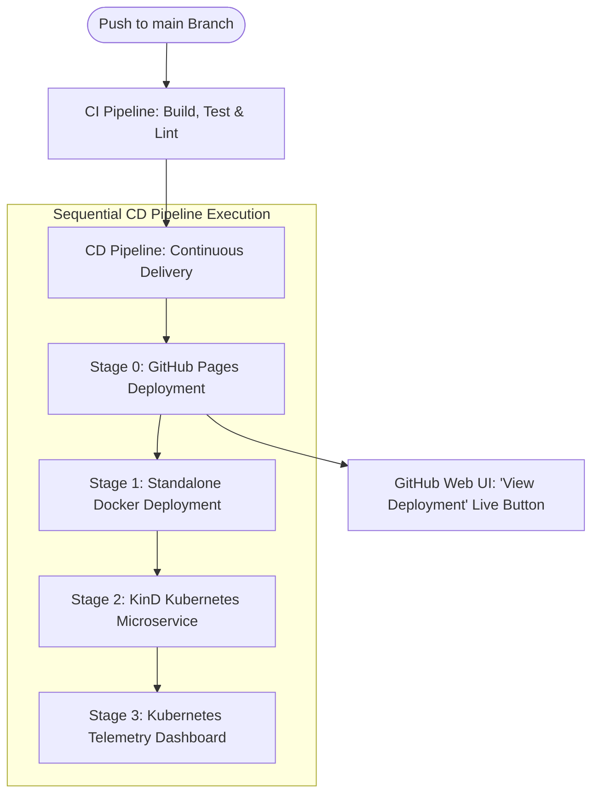

# CI/CD Automated Demonstration Plan

This document outlines the standard architecture and execution plan for 100% automated student demonstrations in the `CI_CD_Demo` repository.

---

## 🎯 Primary Objective
Deliver a **100% fully automated CI/CD demonstration** for students with **zero manual steps or terminal commands** required during live teaching.

---

## 🏗️ Architecture & Pipeline Stages

---

## 📋 Detailed Stage Breakdown

### 1. Automated CI Pipeline (`.github/workflows/ci.yml`)
- **Code Checkout**: Downloads latest source code.
- **Environment Setup**: Configures Node.js 24 environment.
- **Quality Control**: Executes `npm run lint` and `npm test`.
- **Docker Validation**: Builds local container image `ceme-calculator-demo:${sha}` and verifies container API endpoint.

### 2. Automated CD Pipeline (`.github/workflows/cd.yml`)
- **Stage 0: Automated Live URL Deployment (`build-and-package-site` & `deploy-production`)**
  - Packages and deploys web portal static assets to GitHub Pages.
  - Exposes the **live public URL** (`environment.url`) directly in the GitHub Actions web interface as a clickable **"View deployment"** button next to the workflow run box.

- **Stage 1: Standalone Docker Deployment (Port 3000)**
  - Authenticates with GitHub Container Registry (`ghcr.io`).
  - Builds and pushes tagged Docker images (`latest` and `${sha}`).
  - Runs container in detached mode on port 3000 and tests health endpoints (`/` and `/api/cluster/info`).
  - Logs step summary endpoints to `$GITHUB_STEP_SUMMARY`.

- **Stage 2: KinD Kubernetes Microservice Deployment (Port 8080)**
  - Provisions ephemeral Kubernetes-in-Docker (KinD) cluster (`ci-cd-demo-cluster`).
  - Authenticates with GHCR and imports Docker image into KinD cluster nodes.
  - Applies declarative Kubernetes manifests (`k8s/namespace.yaml`, `deployment.yaml`, `service.yaml`, `ingress.yaml`).
  - Verifies rollout status and tests forwarded microservice endpoint on port 8080.

- **Stage 3: Kubernetes Telemetry & Dashboard (Port 46723)**
  - Provisions dedicated telemetry cluster (`ci-cd-demo-telemetry`).
  - Deploys official Kubernetes Web UI Dashboard.
  - Exposes `kubectl proxy` on port 46723 and dumps cluster resources to `telemetry_output/`.
  - Uploads `k8s-telemetry-report` artifact for student review.

---

## 🎓 Student Demonstration Flow (Zero Manual Work)

1. **Trigger**: Instructor or student pushes code to `main` (or clicks *Run workflow* in GitHub Actions GUI).
2. **Autonomous Sequential Execution**: CI and CD pipelines run without human intervention, completing Stage 0 (GitHub Pages) -> Stage 1 (Docker) -> Stage 2 (KinD Kubernetes) -> Stage 3 (Telemetry & Dashboard) in strict sequence.
3. **GUI Verification**: Students navigate to the **Actions** tab on GitHub:
   - Click the active workflow run.
   - Click the green **"View deployment"** button rendered directly in the GitHub GUI to open the live web application.
   - Download the `k8s-telemetry-report` artifact from the run summary.
