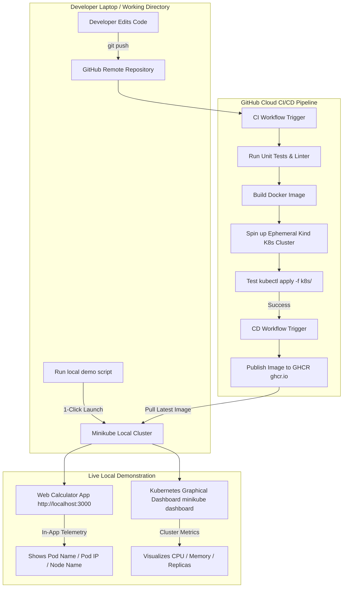

# Implementation Plan & Architectural Explanation: "(Recommended) Both" Workflow

This document provides a comprehensive breakdown of the **"(Recommended) Both"** architecture—combining **Cloud GitHub Actions CI/CD Automation** with a **Local 1-Click Minikube Graphical Dashboard Demo**.

---

## 1. Goal Description
The objective is to explain how two complementary environments operate together in modern DevOps and Kubernetes microservice development:
1. **GitHub Actions CI/CD (Cloud Pipeline)**: Automated validation, linting, unit testing, Docker image creation, and automated Kubernetes deployment testing on every `git push`.
2. **Minikube Local Environment (Interactive Live Demo)**: Local 1-click execution on a developer laptop to run the application in a real Kubernetes cluster, interact with the web calculator UI, and inspect live cluster metrics via the official graphical **Kubernetes Dashboard**.

---

## 2. Architecture & Interaction Diagram

---

## 3. Detailed Component Breakdown

### Component 1: Cloud GitHub Actions CI/CD Pipeline
* **Where it runs**: On GitHub's free cloud infrastructure (`ubuntu-latest` runners).
* **When it triggers**: Automatically whenever you push code or open a Pull Request.
* **What it does**:
  1. **Linting & Unit Tests**: Runs `npm run lint` and `npm test` (8 unit tests).
  2. **Docker Image Build**: Runs `docker build -t ceme-calculator-demo .` to verify that the multi-stage `Dockerfile` compiles cleanly.
  3. **Container Health Test**: Starts a container, performs HTTP checks against `/api/cluster/info`, and verifies pod telemetry endpoints.
  4. **Ephemeral K8s Cluster Test**: Spins up a temporary Kubernetes in Docker (`kind`) cluster inside the GitHub runner, applies `k8s/*.yaml`, and verifies zero-downtime pod rollout.
  5. **Image Registry Release (CD)**: On merge to `main`, automatically tags and pushes the container image to **GitHub Container Registry (`ghcr.io`)**.

---

### Component 2: Local Minikube Live Demo & Cluster Dashboard
* **Where it runs**: On your local computer or laptop.
* **When it triggers**: Whenever you want to present or demonstrate the working application live to an audience or evaluator.
* **What it does**:
  1. **1-Click Local Cluster Startup**: Running `minikube start` creates a single-node Kubernetes cluster locally in ~30 seconds.
  2. **Deploy Manifests**: Running `kubectl apply -f k8s/` creates the `ci-cd-demo` namespace, 3 load-balanced application pods (`calculator-pod-1`, `2`, `3`), and a Kubernetes `ClusterIP` service.
  3. **Access Live App (Tab 1)**: `kubectl port-forward svc/calculator-service 3000:80 -n ci-cd-demo` exposes the web calculator on `http://localhost:3000`. You can perform addition, subtraction, multiplication, division, and power calculations while seeing real-time pod routing metadata (`POD_NAME`, `POD_IP`).
  4. **Open Graphical Dashboard (Tab 2)**: Running `minikube dashboard` opens the official Web UI in your default browser. You can select namespace `ci-cd-demo` to inspect:
     - Workloads & Active Replicas (`3/3 Running`)
     - Pod CPU and Memory consumption
     - Service endpoints & IP routing
     - Real-time container logs & event stream

---

## 4. Why This Combined Approach is Recommended

| Criteria | Only GitHub Actions | Only Local Minikube | Combined "(Recommended) Both" |
| :--- | :--- | :--- | :--- |
| **Automation** |  100% Automated on Push | ❌ Manual Execution |  Automated CI/CD + Manual Demo Control |
| **Visual Dashboard** | ❌ Text Logs Only |  Full Browser Dashboard |  Full Browser Dashboard + CI/CD Logs |
| **Cost** |  100% Free |  100% Free |  100% Free |
| **Demonstrability** | ⚠️ Hard to show live interactive UI |  Easy live interactive demo |  Show automated CI checkmark AND live UI |
| **Reliability** |  Catches broken code before deploy | ⚠️ Might fail if code broken |  Guaranteed passing code deployed locally |

---

## 5. Summary of Files to Fulfill This Setup

1. **[CI Workflow]** `.github/workflows/ci.yml` – Handles linting, tests, Docker build, and Kind cluster testing.
2. **[CD Workflow]** `.github/workflows/cd.yml` – Handles publishing Docker image to `ghcr.io`.
3. **[Kubernetes Manifests]** `k8s/*.yaml` – Standard Kubernetes Deployment, Service, Namespace, and Ingress manifests.
4. **[Demo Guide]** `docs/k8s_demo_guide.md` – Step-by-step instructions for running `minikube start`, `kubectl apply`, and `minikube dashboard`.
