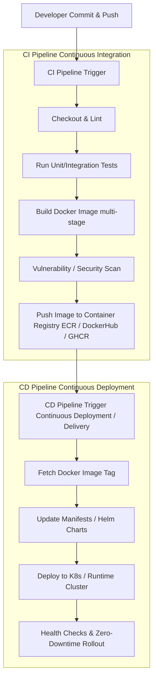

# Implementation Plan: Role of CI and CD in Docker-Based Development

This document outlines the detailed plan to explain the core concepts, architecture, benefits, and workflows of Continuous Integration (CI) and Continuous Delivery/Deployment (CD) in a Docker-containerized application environment.

## 1. Goal Description
The objective is to provide a comprehensive, clear, and structured explanation of how Continuous Integration (CI) and Continuous Deployment/Delivery (CD) function within Docker-based software engineering. Using the context of this repository (`CEME-DC-SE-CI_CD_K8s_Demo`), the explanation will cover:
- **Foundations**: The fundamental roles of CI and CD in modern DevOps.
- **Docker Integration**: How Docker containerization changes and enhances traditional CI/CD pipelines (reproducibility, isolated test environments, image registries).
- **CI Pipeline Breakdown**: Code checkout, linting, testing, Docker image building, scanning, and registry pushing.
- **CD Pipeline Breakdown**: Image tagging, deployment to target runtime environments (e.g., Kubernetes, Docker Swarm, Cloud services), container updates, and rollback mechanisms.
- **Architectural Diagrams**: Flowcharts showcasing the transition from developer commit to running containerized application.

---

## 2. User Review Required

> [!NOTE]
> This plan will produce a structured guide/document in the repository summarizing Docker-based CI/CD architecture and aligning it with the existing workflow configurations (`.github/workflows/ci.yml`, `.github/workflows/cd.yml`, `Dockerfile`, and `k8s/`).

Please review the proposed structure below and confirm if any additional topics (such as GitOps with ArgoCD/Flux, container vulnerability scanning with Trivy, or specific cloud target environments) should be included.

---

## 3. Open Questions

1. **Target Depth**: Would you like the final documentation file saved into the repository as a dedicated guide (e.g., `docker_ci_cd_guide.md`), or is a direct interactive response preferred?
2. **Additional Security Scanning**: Should the pipeline breakdown include container image vulnerability scanning tools (e.g., Trivy, Grype, Docker Scout)?

---

## 4. Proposed Content Structure

### Key Topics Covered in the Guide

#### 1. Introduction to CI & CD in Containerized Workflows
- **CI (Continuous Integration)**: Automatically building, linting, testing, and containerizing code changes with every commit to detect bugs early.
- **CD (Continuous Delivery / Continuous Deployment)**:
  - *Continuous Delivery*: Automatically preparing release-ready container artifacts and deploying to staging automatically, requiring approval for production.
  - *Continuous Deployment*: Automatically releasing every passing container build directly into production without manual intervention.

#### 2. Why Docker is a Game-Changer for CI/CD
- **Environment Consistency ("Works on My Machine" Solution)**: Standardized runtime across developer laptops, CI runners, and production clusters.
- **Multi-Stage Builds**: Keeping final artifacts small and secure by separating build toolchains from runtime base images.
- **Immutable Artifacts**: The exact Docker image generated and verified during CI is what gets deployed in CD.

#### 3. Breakdown of Docker-Based CI Workflow
- **Step 1: Code Triggers & Linting**: Automated checks on push/PR.
- **Step 2: Automated Testing**: Running unit tests inside or alongside containerized dependencies.
- **Step 3: Multi-Stage Container Build**: Compiling assets and packaging only production runtime dependencies.
- **Step 4: Image Vulnerability Scanning**: Checking base images and OS packages for CVEs.
- **Step 5: Registry Push**: Tagging with commit SHA/semantic version and pushing to Docker Hub, GitHub Container Registry (GHCR), or AWS ECR.

#### 4. Breakdown of Docker-Based CD Workflow
- **Step 1: Deployment Strategy**: Rolling Updates, Blue/Green, or Canary deployments.
- **Step 2: Orchestration Integration**: Updating Kubernetes deployments (`k8s/deployment.yaml`), Helm charts, or Docker Compose services with new image tags.
- **Step 3: Live Verification & Health Checks**: Liveness and readiness probes ensuring zero downtime.
- **Step 4: Automatic Rollbacks**: Fast fallback to previous immutable image tags if health checks fail.

---

## 5. Verification Plan

### Manual Verification
- Review the generated structure for clarity, completeness, and alignment with modern DevOps best practices.
- Verify existing workspace workflows (`npm test`, `npm run lint`) remain intact and functional.
